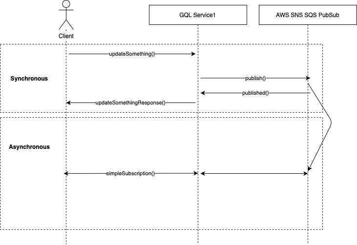
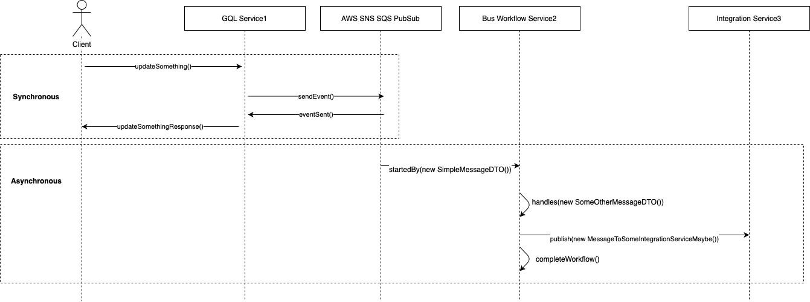

# @sagahead/graphql-snssqs-subscriptions

This package implements the PubSubEngine Interface from the [graphql-subscriptions](https://github.com/apollographql/graphql-subscriptions) package. Once initiated this library automatically create subscriptions between SNS and SQS by the given configuration.

```bash
npm install @sagahead/graphql-snssqs-subscriptions
```

```bash
yarn add @sagahead/graphql-snssqs-subscriptions
```

Package example can be found in [sagahead.io ecommerce-blueprint](https://github.com/sagahead-io/ecommerce-blueprint). This package is maintained and released by the ecommerce-blueprint owners.

## Features

- Automatically creates SNS topic
- Automatically creates SQS queue
- Automatically creates subscriptions from SNS to SQS.
- Automatically creates Dead Letter Queues
- Maps message metadata to MessageAttributes
- Batched mode up to 10 messages
- [@node-ts/bus](https://www.npmjs.com/package/node-ts) compatible
- [TypeGraphQL](https://github.com/MichalLytek/type-graphql) compatible
- [localstack](https://github.com/localstack/localstack) compatible

## Install the pubsub in graphql server

```typescript
import { SNSSQSPubSub } from '@sagahead/graphql-snssqs-subscriptions'
import env from '../utils/env'

let awsEndpoints = {}

// if using localstack
if (process.env.NODE_ENV === 'development') {
  awsEndpoints = {
    sns: {
      endpoint: `${env.AWS_SNS_ENDPOINT}`,
    },
    sqs: {
      endpoint: `${env.AWS_SQS_ENDPOINT}`,
    },
  }
}

export const getPubSub = async (): Promise<SNSSQSPubSub> => {
  const pubsub = new SNSSQSPubSub(
    {
      accessKeyId: env.AWS_ACCESS_KEY_ID,
      secretAccessKey: env.AWS_SECRET_ACCESS_KEY,
      region: env.AWS_REGION,
      ...awsEndpoints,
    },
    {
      serviceName: env.SERVICE_NAME,
    },
  )
  await pubsub.init()
  return pubsub
}

const bootstrap = async () => {
  const pubSub = await getPubSub()

  const server = new ApolloServer({
    schema,
    context: (req: any): MyServiceContext => ({
      ...req,
      pubSub, // ctx.pubsub will be available in your service context
    }),
  })

  await server.listen(env.SERVICE_PORT)
  logger.info(`Service is listening on port: ${env.SERVICE_PORT}`)
}

bootstrap().catch(logger.error)
```

## TypeGraphQL resolver mutation and subscription example



```typescript
import { MessageAttributes } from '@sagahead/graphql-snssqs-subscriptions';

export class Resolver {
  Mutation(() => UpdateSomethingResponse)
  async updateSomething(
    @Ctx() ctx: MyServiceContext,
    @Arg('input') inputData: UpdateSomethigInput
  ): Promise<UpdateSomethingResponse> {

    // ... some logic...

    ctx.pubSub.publish(
      'someTriggerName', // this is your topic
      {
        anyPayload: 'string'
      },
      new MessageAttributes({
        correlationId: `${ctx.account.id}`,
      })
    );

    return UpdateSomethingResponse(true);
  }

  @Subscription(() => Notification, { topics: 'someTriggerName', nullable: true })
  simpleSubscription (@Root() { anyPayload }: NotificationPayload) {
    return { anyPayload };
  }
}
```

## TypeGraphQL resolver communicaiton between graphql and @node-ts/bus services

- More Info on graphql framework [TypeGraphQL](https://typegraphql.ml/docs/introduction.html)
- More Info on service bus framework [@node-ts/bus](https://github.com/node-ts/bus)



```typescript
// packages/service1 Resover
import { MessageAttributes } from '@sagahead/graphql-snssqs-subscriptions';

class SimpleMessageDTO {
  readonly $name = `${env.APP_DOMAIN}/${env.MY_SERVICE_NAME}/message-subject-or-anything`;
  readonly $version = 1;

  msgDataString: string;

  constructor(msgDataString: string) {
    this.msgDataString = msgDataString;
  }
}

export class Resolver {
  Mutation(() => UpdateSomethingResponse)
  async updateSomething(
    @Ctx() ctx: MyServiceContext,
    @Arg('input') inputData: UpdateSomethigInput
  ): Promise<UpdateSomethingResponse> {

    // ... some logic...

    // Methods publish, sendEvent, sendCommand
    ctx.pubSub.sendEvent(
      new SimpleMessageDTO({
        msgDataString: 'some data in message',
      }),
      new MessageAttributes({
        correlationId: `${ctx.account.id}`,
      })
    );

    return UpdateSomethingResponse(true);
  }
}
```

```typescript
// packages/service2 Workflows
class SimpleMessageDTO {
  readonly $name = `${env.APP_DOMAIN}/${env.MY_SERVICE_NAME}/message-subject-or-anything`
  readonly $version = 1

  msgDataString: string

  constructor(msgDataString: string) {
    super()
    this.msgDataString = msgDataString
  }
}

@injectable()
export class MyWorkflow extends Workflow<MyWorkflowData> {
  constructor(
    @inject(BUS_SYMBOLS.Bus) private readonly bus: Bus,
    @inject(LOGGER_SYMBOLS.Logger) private readonly logger: Logger,
  ) {
    super()
  }

  /**
   * Starts a new workflow smessage SimpleMewssageDTO is fired
   */
  @StartedBy<SimpleMessageDTO, MyWorkflowData, 'handleSimpleMessage'>(SimpleMessageDTO)
  async handlesSimpleMessage(
    event: SimpleMessageDTO,
    _: MyWorkflowData,
    messageAttributes: MessageAttributes,
  ): Promise<Partial<MyWorkflowData>> {
    const { msgDataString } = event

    this.bus.send(new SomeOtherMessageDto())

    return {
      msgDataString,
      correlationId: messageAttributes.correlationId,
    }
  }

  @Handles<SomeOtherMessageDto, MyWorkflowData, 'someNewMessageHandler'>(
    SomeOtherMessageDto,
    (event, attributes) => attributes.correlationId,
    'correlationId',
  )
  someNewMessageHandler(): Partial<MyWorkflowData> {
    // Do whatever in this message handler
    this.bus.publish(new MessageToSomeIntegrationServiceMaybe())
    this.complete()
  }
}
```

## Contributing

Bug reports and pull requests are welcome on GitHub at https://github.com/sagahead-io/ecommerce-blueprint/issues. This project is intended to be a safe, welcoming space for collaboration, and contributors are expected to adhere to the [Contributor Covenant](http://contributor-covenant.org) code of conduct.

## License

The lib is available as open source under the terms of the [MIT License](https://opensource.org/licenses/MIT).

## Code of Conduct

Everyone interacting in the @sagahead/graphql-snssqs-subscriptions project’s codebases, issue trackers, chat rooms and mailing lists is expected to follow the [code of conduct](https://github.com/sagahead-io/ecommerce-blueprint/tree/master/CODE_OF_CONDUCT.md).
